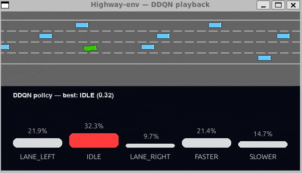

# ece-1508-rl-highway-driving

## Overview
This repository implements and compares Deep Reinforcement Learning algorithms for autonomous highway driving using the `highway-env` simulator. The project evaluates three RL algorithms: Deep Q-Network (DQN), Double Deep Q-Network (DDQN), and Proximal Policy Optimization (PPO), alongside a rule-based baseline agent. Models are trained and evaluated across different traffic densities (1.0, 1.5, and 2.0 vehicles per lane) to assess robustness and performance in varying traffic conditions.

## Setup
1. Create and activate a virtual environment:
   ```shell
   python -m venv venv
   source venv/bin/activate  # On Windows: venv\Scripts\activate
   ```

2. Install the required dependencies from `requirements.txt`:
   ```shell
   pip install -r requirements.txt
   ```

3. Additionally install the gymnasium extras package:
   ```shell
   pip install "gymnasium[other]"
   ```

This will install all necessary packages including PyTorch, Stable-Baselines3, highway-env, and other dependencies required for training and evaluation.

## Project Structure
- `config.json` - Environment configuration file (traffic density, rewards, episode duration, etc.)
- `benchmark.py` - Evaluation script for benchmarking trained models across multiple configurations
- `dqn_agent.py` - DQN training script using Stable-Baselines3
- `ddqn_agent.py` - Double DQN training script (custom PyTorch implementation)
- `ppo_agent_v2.py` - PPO training script using Stable-Baselines3
- `baseline/baseline.py` - Rule-based baseline agent implementation
- `playDQN.py` - Visualization tool for running and displaying trained models
- `models/` - Directory containing trained model checkpoints organized by algorithm and density
- `doubledqn_*/` - DDQN training outputs (logs, checkpoints, training_logs.npz) for different densities

## Configuration
The `config.json` file controls the highway environment settings used during training and evaluation. Key parameters include:
- `vehicles_density`: Traffic density (1.0 = light, 1.5 = moderate, 2.0 = heavy traffic)
- `collision_reward`: Penalty for collisions (typically -20.0)
- `high_speed_reward`: Reward coefficient for maintaining high speed
- `duration`: Episode length in seconds (default: 40)
- `policy_frequency`: Control frequency in Hz (default: 3)
- `simulation_frequency`: Physics simulation frequency in Hz (default: 5)

Modify these parameters to change the training environment characteristics. All training scripts load this configuration file, though individual scripts may override specific parameters.

## Benchmarking trained models
Trained models are listed under `./models/`. The base `highway-env` config is listed under `config.json`. 

To benchmark a model, activate your virtual environment, install the requirements from `requirements.txt` and then run `benchmark.py`.
```text
>>> python benchmark.py --help
usage: benchmark.py [-h] [--use_density {1,2}] [-f FILEPATH] {BASELINE,DQN,PPO,DDQN}

Tests each trained model on various vehicle densities and extracts performance metrics. By default, uses models
trained with vehicle density 1.5.

positional arguments:
  {BASELINE,DQN,PPO,DDQN}
                        The model type to use as the RL agent for benchmarking.

options:
  -h, --help            show this help message and exit
  --use_density {1,2}   Specify to use a variant of the model that was trained with vehicle density 1 or 2. Note that
                        this is not the vehicle density used for the benchmarking. Exclude this argument for the
                        default training vehicle density of 1.5.
  -f FILEPATH, --filepath FILEPATH
                        Specify a filepath to a trained model of the appropriate type. Omitting this will default to
                        the latest trained model for that model type.
```

### Example usage

Sample input for running `benchmark.py` on DDQN with trained density 2:
```shell
python benchmark.py DDQN --use_density 2
```

Sample output for running `benchmark.py` on DDQN with trained density 2:
```text
>>> python benchmark.py DDQN --use_density 2
Model: DDQN (loading from models/DDQN_density2\policy_net.pth)
======================================================================
Highway Model Benchmark Summary (100 eps/config, n_env=4)
Model type: MODEL_TYPE.DDQN
======================================================================
density=1.0, duration=40s
  Avg Reward     :   48.990
  Collision Rate :     2.00%
  Avg Speed      :   20.519 ±  0.081 m/s
  Avg Distance   :  808.792 ±  8.595 m
  RMS Accel      :    0.986 m/s^2
  RMS Jerk       :    3.217 ±  0.412 m/s^3
  Action distribution (total actions = 12000):
      [0] LANE_LEFT :   2.11% (253 actions)
      [1] IDLE      :   8.58% (1029 actions)
      [2] LANE_RIGHT:   2.90% (348 actions)
      [3] FASTER    :   3.69% (443 actions)
      [4] SLOWER    :  82.73% (9927 actions)
------------------------------------------------------------
density=1.5, duration=40s
  Avg Reward     :   51.255
  Collision Rate :    10.00%
  Avg Speed      :   21.402 ±  0.066 m/s
  Avg Distance   :  821.746 ± 12.745 m
  RMS Accel      :    2.477 m/s^2
  RMS Jerk       :   10.131 ±  0.358 m/s^3
  Action distribution (total actions = 11732):
      [0] LANE_LEFT :   6.72% (788 actions)
      [1] IDLE      :  33.23% (3898 actions)
      [2] LANE_RIGHT:   8.24% (967 actions)
      [3] FASTER    :  14.68% (1722 actions)
      [4] SLOWER    :  37.14% (4357 actions)
------------------------------------------------------------
density=2.0, duration=40s
  Avg Reward     :   41.379
  Collision Rate :    22.00%
  Avg Speed      :   20.587 ±  0.038 m/s
  Avg Distance   :  749.487 ± 16.966 m
  RMS Accel      :    1.504 m/s^2
  RMS Jerk       :    5.442 ±  0.271 m/s^3
  Action distribution (total actions = 11144):
      [0] LANE_LEFT :  12.12% (1351 actions)
      [1] IDLE      :  39.43% (4394 actions)
      [2] LANE_RIGHT:  11.48% (1279 actions)
      [3] FASTER    :   6.10% (680 actions)
      [4] SLOWER    :  30.87% (3440 actions)
------------------------------------------------------------
density=1.0, duration=20s
  Avg Reward     :   26.012
  Collision Rate :     1.00%
  Avg Speed      :   20.686 ±  0.073 m/s
  Avg Distance   :  420.179 ±  1.489 m
  RMS Accel      :    1.283 m/s^2
  RMS Jerk       :    4.528 ±  0.538 m/s^3
  Action distribution (total actions = 6100):
      [0] LANE_LEFT :   0.67% (41 actions)
      [1] IDLE      :   9.11% (556 actions)
      [2] LANE_RIGHT:   3.79% (231 actions)
      [3] FASTER    :   5.72% (349 actions)
      [4] SLOWER    :  80.70% (4923 actions)
------------------------------------------------------------
density=1.5, duration=20s
  Avg Reward     :   24.668
  Collision Rate :     7.00%
  Avg Speed      :   20.909 ±  0.072 m/s
  Avg Distance   :  410.731 ±  6.079 m
  RMS Accel      :    1.824 m/s^2
  RMS Jerk       :    6.962 ±  0.456 m/s^3
  Action distribution (total actions = 6032):
      [0] LANE_LEFT :   6.90% (416 actions)
      [1] IDLE      :  36.47% (2200 actions)
      [2] LANE_RIGHT:   8.54% (515 actions)
      [3] FASTER    :   8.87% (535 actions)
      [4] SLOWER    :  39.22% (2366 actions)
------------------------------------------------------------
density=2.0, duration=20s
  Avg Reward     :   23.457
  Collision Rate :     6.00%
  Avg Speed      :   20.510 ±  0.029 m/s
  Avg Distance   :  406.483 ±  4.681 m
  RMS Accel      :    1.331 m/s^2
  RMS Jerk       :    4.210 ±  0.223 m/s^3
  Action distribution (total actions = 5992):
      [0] LANE_LEFT :  12.83% (769 actions)
      [1] IDLE      :  40.02% (2398 actions)
      [2] LANE_RIGHT:  11.23% (673 actions)
      [3] FASTER    :   4.17% (250 actions)
      [4] SLOWER    :  31.74% (1902 actions)
------------------------------------------------------------
```

## Training Models
To train a model, run the appropriate training script. Model hyperparameters can be modified by editing the configuration variables directly in each script file. Environment configuration is loaded from `config.json`, though scripts may override specific parameters.

### DQN (`dqn_agent.py`)
Uses Stable-Baselines3 DQN implementation. Key hyperparameters (editable in the script):
- Learning rate: `5e-4`
- Buffer size: `150_000`
- Batch size: `256`
- Gamma: `0.80`
- Exploration: Linear decay from `0.8` to `0.08` over 5M steps
- Parallel environments: `16`
- Total timesteps: `10_000_000`

Models are saved to `models/DQN/` with checkpoints saved every 100k steps.

### DDQN (`ddqn_agent.py`)
Custom PyTorch implementation of Double DQN. Key hyperparameters (editable in the script):
- Learning rate: `5e-4`
- Buffer size: `150_000`
- Batch size: `256`
- Gamma: `0.99`
- Target network update interval: `1000` steps
- Exploration: Linear decay from `0.8` to `0.08` over 5M steps
- Parallel environments: `9`
- Total timesteps: `10_000_000`

Training density can be set via `CONFIG_OVERRIDES` dictionary. Models are saved to directories like `doubledqn_density1/`, `doubledqn_density2/`, etc., with training logs saved as `training_logs.npz`.

### PPO (`ppo_agent_v2.py`)
Uses Stable-Baselines3 PPO implementation. Key hyperparameters (editable in the script):
- Learning rate: `3e-4`
- Batch size: `256`
- Network architecture: `[256, 256]`
- Gamma: `0.8`
- GAE lambda: `0.95`
- Clip range: `0.2`
- Entropy coefficient: `0.01`
- Parallel environments: `8`
- Total timesteps: `10_000_000`

Models are saved to `models/PPO_density*/` directories.

## Baseline Agent
The rule-based baseline agent (`baseline/baseline.py`) implements a simple driving policy that maintains target speed, performs lane changes when safe, and slows down when following slower vehicles. The agent does not require training and can be benchmarked directly.

To benchmark the baseline agent:
```shell
python benchmark.py BASELINE
```

The baseline agent behavior can be customized by modifying parameters in `baseline/baseline.py` (target speed, headway thresholds, etc.). 

## Visualizing Models
`playDQN.py` offers a way to visualize trained models playing trajectories in `highway-env`. The script supports both Stable-Baselines3 DQN models and custom Double DQN implementations.

### Usage

To visualize a trained model:

```shell
# Play SB3 DQN model
python playDQN.py

# Play Double DQN model (final checkpoint)
python playDQN.py --ddqn

# Play Double DQN from a specific checkpoint
python playDQN.py --ddqn --checkpoint 10000000
```

### Demo

  